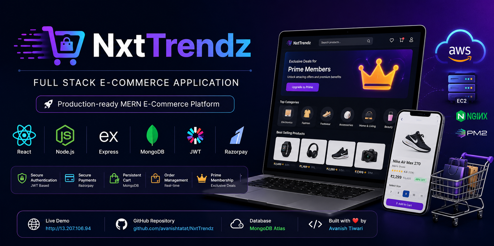
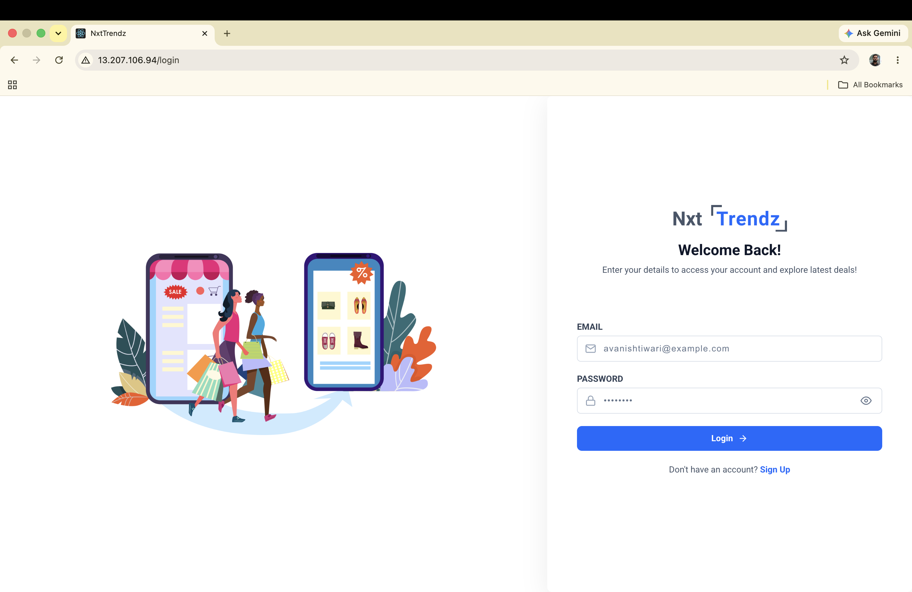
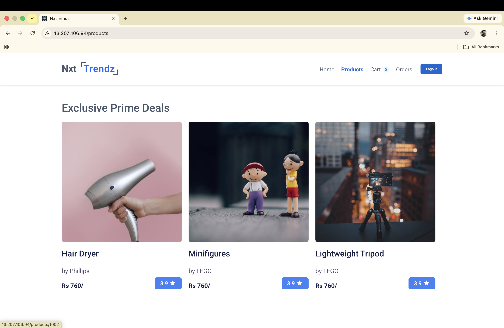
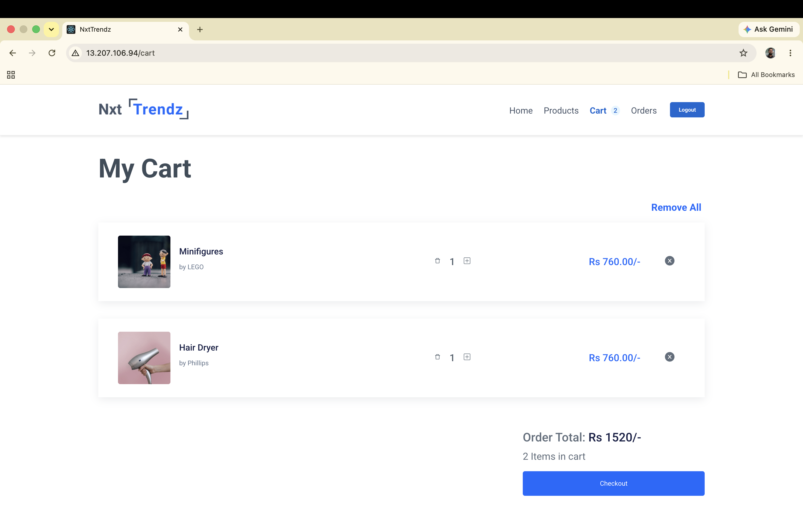
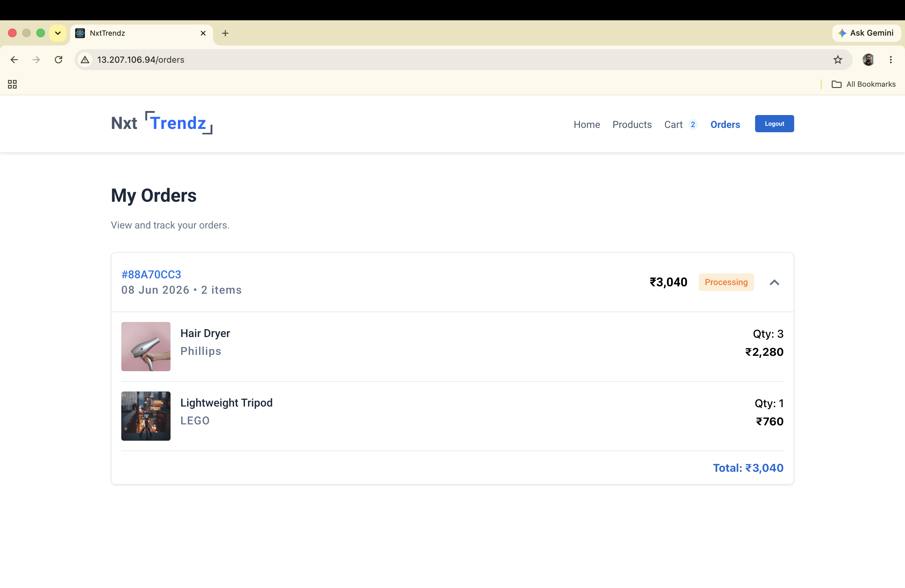

<p align="center">
  
</p>

# NxtTrendz

Full Stack E-Commerce Application

[](https://react.dev/)
[](https://vitejs.dev/)
[](https://nodejs.org/)
[](https://expressjs.com/)
[](https://www.mongodb.com/atlas)
[](https://jwt.io/)
[](https://razorpay.com/)
[](https://aws.amazon.com/ec2/)
[](https://nginx.org/)
[](https://pm2.keymetrics.io/)
[](https://opensource.org/licenses/MIT)

[](http://13.207.106.94)

[](https://github.com/avanishtatat/NxtTrendz)

**Built by:** Avanish Tiwari

## Overview

NxtTrendz is a full-stack e-commerce application that evolved from a frontend-only React project into a production-style shopping platform with a Node.js + Express backend, MongoDB persistence, JWT authentication, and Razorpay-powered payments. It supports user registration with Free/Prime plan selection, protected shopping flows, persistent carts, and order history. The frontend uses React 18 with Vite, Context API, Axios interceptors, and reusable payment/cart flows. The backend proxies product data from NxtWave APIs and keeps sensitive operations such as payment verification, subscription updates, and order creation on the server.

> Note: The current codebase uses plain CSS and react-icons. Tailwind CSS and Lucide React are not part of the verified implementation.

## Features

- 🔐 Authentication with JWT-based registration, login, logout, and protected routes.
- 👤 Free/Prime plan selection during signup, plus Prime upgrade from the deals banner.
- 🛍️ Product browsing with search, category filters, ratings filter, and product details pages.
- ⭐ Prime-only deals locked behind an active subscription.
- 🛒 Persistent cart stored in MongoDB with quantity updates, optimistic UI, and auto-load on login.
- 💳 Razorpay checkout integration for both cart checkout and Prime subscription.
- 🧾 Server-side Razorpay signature verification before order creation or Prime activation.
- 📦 Order history and order detail views backed by MongoDB.
- ⚡ Shared `usePrimePayment` hook and lazy Razorpay SDK loading for reusable payment flows.
- 🔁 Token refresh on app load through the auth profile endpoint so Prime status stays current.
- 🚀 Production deployment on AWS EC2 Ubuntu with frontend and backend served from one instance.
- 🔀 Nginx reverse proxy routes frontend and API traffic through the same Elastic IP.
- ⚙️ PM2-based backend process management for reliable runtime and restart handling.
- ♻️ Automatic backend restart after server reboot via PM2 startup configuration.

## Tech Stack

| Layer | Tools |
| --- | --- |
| Frontend | React 18, Vite, React Router DOM v6, Axios, React Hot Toast, react-icons, react-loader-spinner, Context API |
| Backend | Node.js, Express.js, MongoDB Atlas, Mongoose, JWT, Bcrypt, Razorpay Node SDK, Axios proxy to NxtWave APIs |
| Styling | Plain CSS / component-scoped CSS |
| Payments | Razorpay checkout.js (loaded on demand) |
| Modules | ES Modules (`import` / `export`) |
| Deployment | AWS EC2, Ubuntu, Nginx, PM2, Elastic IP |

## Deployment

The frontend and backend are deployed on a single AWS EC2 Ubuntu instance and are accessible through one Elastic IP.

**Live URL:** http://13.207.106.94

### Production Deployment Details

- AWS EC2 Ubuntu Server
- Elastic IP attached to the EC2 instance
- Nginx configured as reverse proxy
- React production build deployed in `/var/www/nxttrendz`
- Express backend running on port `5000`
- PM2 used for process management
- PM2 startup configured for automatic restart after server reboot
- MongoDB Atlas used as the cloud database
- Frontend and backend accessible through the same Elastic IP
- Nginx routes frontend requests to static React files and `/api/*` requests to Express backend

## Architecture

```text
              INTERNET
                 │
                 ▼
        ┌─────────────────┐
        │   Elastic IP    │
        │  13.207.106.94  │
        └────────┬────────┘
                 │
                 ▼
        ┌─────────────────┐
        │      Nginx      │
        │  Reverse Proxy  │
        └────────┬────────┘
                 │
         ┌───────┴────────┐
         │                │
         ▼                ▼
┌──────────────┐  ┌──────────────────┐
│ React Build  │  │ Express Backend  │
│ /var/www/    │  │ localhost:5000   │
│ nxttrendz    │  │ (PM2 managed)    │
└──────────────┘  └────────┬─────────┘
Static files               │
(HTML/CSS/JS)              ▼
                   ┌──────────────────┐
                   │  MongoDB Atlas   │
                   │  (Cloud DB)      │
                   └──────────────────┘

Nginx routes:
/* → React static files
/api/* → Express backend
```

## Screenshots

### Login Page


### Home Page


### Products Page


### Product Details Page


### Cart Page


### Orders Page


## 📺 Demo Video

[](https://youtu.be/AL5l0mAiP3Y)

> Full walkthrough of features including Razorpay payment, 
> prime subscription, cart management, and AWS EC2 deployment.

## Getting Started

### Prerequisites

- Node.js 20.19 or later
- MongoDB Atlas account
- Razorpay test account
- NxtWave API credentials for Prime and Free users

### Clone the repository

```bash
git clone https://github.com/avanishtatat/NxtTrendz.git
cd NxtTrendz
```

### Setup the server

```bash
cd server
npm install
```

Copy `server/.env.example` to `server/.env`, fill in the required values, and do not commit the actual `.env` file:

```bash
cp .env.example .env
```

Start the API:

```bash
npm run dev
```

### Setup the client

```bash
cd ../client
npm install
```

Copy `client/.env.example` to `client/.env`, fill in the required values, and do not commit the actual `.env` file:

```bash
cp .env.example .env
```

Run the frontend:

```bash
npm run dev
```

## Production Deployment (AWS EC2 Ubuntu)

### 1. Build the React app

```bash
cd client
npm install
npm run build
```

### 2. Copy the build output to Nginx web root

```bash
sudo mkdir -p /var/www/nxttrendz
sudo cp -r dist/* /var/www/nxttrendz/
```

### 3. Configure Nginx for static frontend + API proxy

Create an Nginx server block that serves `/var/www/nxttrendz` for frontend routes and forwards `/api/*` to `http://localhost:5000`.

```nginx
server {
	listen 80;
	server_name 13.207.106.94;

	root /var/www/nxttrendz;
	index index.html;

	location /api/ {
		proxy_pass http://localhost:5000;
		proxy_http_version 1.1;
		proxy_set_header Upgrade $http_upgrade;
		proxy_set_header Connection 'upgrade';
		proxy_set_header Host $host;
		proxy_cache_bypass $http_upgrade;
	}

	location / {
		try_files $uri /index.html;
	}
}
```

### 4. Start backend with PM2

```bash
cd server
npm install
pm2 start app.js --name nxttrendz-api
pm2 save
```

### 5. Configure PM2 startup on reboot

```bash
pm2 startup
```

Run the command printed by PM2 (with `sudo`) and then run:

```bash
pm2 save
```

### 6. Attach and use Elastic IP

- Allocate an Elastic IP in AWS.
- Attach it to the EC2 instance.
- Update Nginx `server_name` and client-facing URLs if needed.

## Environment Variables

The project includes `client/.env.example` and `server/.env.example`. Use them as templates, copy them to `.env`, fill in the required values, and keep real secrets out of version control.

### `server/.env`

| Variable | Required | Purpose |
| --- | --- | --- |
| `PORT` | Yes | Server port, usually `5000` |
| `MONGODB_URI` | Yes | MongoDB Atlas connection string |
| `JWT_SECRET` | Yes | Secret used to sign JWTs |
| `RAZORPAY_KEY_ID` | Yes | Razorpay public key used by the server |
| `RAZORPAY_KEY_SECRET` | Yes | Razorpay secret key used for signature verification |
| `NXTWAVE_PRIME_USERNAME` | Yes | NxtWave Prime API username |
| `NXTWAVE_PRIME_PASSWORD` | Yes | NxtWave Prime API password |
| `NXTWAVE_FREE_USERNAME` | Yes | NxtWave Free API username |
| `NXTWAVE_FREE_PASSWORD` | Yes | NxtWave Free API password |
| `CLIENT_URL` | Yes | Frontend origin for CORS, e.g. `http://localhost:3000` (local) or `http://13.207.106.94` (EC2) |

**`server/.env.example`**

```env
PORT=5000
CLIENT_URL=http://localhost:3000
MONGODB_URI=
JWT_SECRET=
RAZORPAY_KEY_ID=
RAZORPAY_KEY_SECRET=
NXTWAVE_PRIME_USERNAME=
NXTWAVE_PRIME_PASSWORD=
NXTWAVE_FREE_USERNAME=
NXTWAVE_FREE_PASSWORD=
```

### `client/.env`

| Variable | Required | Purpose |
| --- | --- | --- |
| `VITE_API_URL` | Yes | Backend API base URL, e.g. `http://localhost:5000/api/v1` (local) or `http://13.207.106.94/api/v1` (EC2 via Nginx) |
| `VITE_RAZORPAY_KEY` | Yes | Razorpay key passed to the checkout widget |

**`client/.env.example`**

```env
VITE_API_URL=http://localhost:5000/api/v1
VITE_RAZORPAY_KEY=
```

### AWS EC2 Deployment Notes

- Keep production secrets only on the server in `server/.env`.
- Build the client with production `VITE_API_URL` before copying files to `/var/www/nxttrendz`.
- Restart the backend process after server-side env updates:

```bash
pm2 restart nxttrendz-api
```

## API Endpoints

All protected endpoints require a valid JWT.

| Domain | Method | Endpoint | Purpose |
| --- | --- | --- | --- |
| Auth | POST | `/api/v1/auth/register` | Register a new user |
| Auth | POST | `/api/v1/auth/login` | Login existing user |
| Auth | GET | `/api/v1/auth/profile` | Fetch current user profile and latest Prime status |
| Products | GET | `/api/v1/products` | Fetch products list |
| Products | GET | `/api/v1/products/prime` | Fetch Prime-only products |
| Products | GET | `/api/v1/products/:id` | Fetch single product details |
| Cart | GET | `/api/v1/cart` | Fetch authenticated user cart |
| Cart | POST | `/api/v1/cart` | Add item to cart |
| Cart | PATCH | `/api/v1/cart/:productId` | Update item quantity |
| Cart | DELETE | `/api/v1/cart/:productId` | Remove a single cart item |
| Cart | DELETE | `/api/v1/cart` | Clear the full cart |
| Orders | GET | `/api/v1/orders` | Fetch order history |
| Orders | GET | `/api/v1/orders/:orderId` | Fetch a single order |
| Payments | POST | `/api/v1/payments/create-order` | Create a Razorpay order for cart checkout |
| Payments | POST | `/api/v1/payments/verify-payment` | Verify Razorpay cart payment signature |
| Payments | POST | `/api/v1/payments/create-prime-order` | Create a Razorpay order for Prime subscription |
| Payments | POST | `/api/v1/payments/verify-prime-payment` | Verify Prime payment and activate membership |

## Project Structure

```text
NxtTrendz/
├── client/
│   ├── index.html
│   ├── package.json
│   └── src/
│       ├── api/
│       │   └── axios.js
│       ├── components/
│       │   ├── Cart/
│       │   ├── CartItem/
│       │   ├── CartListView/
│       │   ├── CartSummary/
│       │   ├── FiltersGroup/
│       │   ├── Header/
│       │   ├── Home/
│       │   ├── PrimeDealsSection/
│       │   ├── ProductCard/
│       │   ├── ProductItemDetails/
│       │   ├── Products/
│       │   ├── ProductsHeader/
│       │   ├── SimilarProductItem/
│       │   └── ProtectedRoute/
│       ├── context/
│       │   ├── AuthContext.jsx
│       │   └── CartContext.jsx
│       ├── hooks/
│       │   └── usePrimePayment.js
│       ├── pages/
│       │   ├── Auth/
│       │   │   ├── LogIn.jsx
│       │   │   └── SignUp.jsx
│       │   ├── Order/
│       │   │   ├── Orders.jsx
│       │   │   └── OrderSuccess.jsx
│       │   ├── Home/
│       │   ├── Products/
│       │   └── Cart/
│       └── App.jsx
├── server/
│   ├── config/
│   │   └── db.js
│   ├── controllers/
│   │   ├── authController.js
│   │   ├── cartController.js
│   │   ├── orderController.js
│   │   ├── paymentController.js
│   │   └── productController.js
│   ├── middleware/
│   │   └── authMiddleware.js
│   ├── models/
│   │   ├── User.js
│   │   ├── Cart.js
│   │   └── Order.js
│   ├── routes/
│   │   ├── auth.js
│   │   ├── cart.js
│   │   ├── orders.js
│   │   ├── payments.js
│   │   └── products.js
│   ├── utils/
│   │   ├── generateToken.js
│   │   ├── checkPrimeStatus.js
│   │   └── nxtWaveProxy.js
│   ├── app.js
│   └── package.json
└── README.md
```

## How It Works

### Authentication

Users register with a selected plan and receive a JWT after successful signup or login. The frontend stores the token in `localStorage`, and authenticated requests use Axios interceptors. On app load, the client calls the profile endpoint to refresh user data and Prime status. Protected routes redirect unauthenticated users to the login page.

### Product Data

The server proxies product requests to NxtWave APIs and caches the upstream token in memory for 55 minutes. The client then uses the authenticated product endpoints to render the catalog, filters, prime deals, and product details pages.

### Prime Subscription

The Prime upgrade flow starts from registration or from the Prime deals banner. The client requests a Razorpay order from the server, then loads the Razorpay SDK on demand through the reusable `usePrimePayment` hook. After payment, the client sends the Razorpay payment details back to the server for HMAC SHA256 verification. If verification succeeds, the server updates `isPrime`, stores the 30-day expiry in MongoDB, and returns a new JWT so the frontend can refresh the user session.

### Cart and Orders

The cart is persisted in MongoDB and scoped per user. Cart updates are applied optimistically in the UI and reverted on failure. Order checkout creates a Razorpay order first, then verifies the payment signature on the server before the order is written. Duplicate payment processing is guarded on the backend, and order history is available from the orders API.

## Demo Credentials

These credentials are useful for exploring the Prime and Free flows in the current setup.

| Account | Username | Password |
| --- | --- | --- |
| Prime | `rahul` | `rahul@2021` |
| Free | `raja` | `raja@2021` |

## Future Improvements

- Selective cart checkout
- Multiple chat sessions
- Cursor-based pagination for orders
- Order cancellation
- Admin dashboard
- Live-mode Razorpay payments
- Push notifications for order updates
- Product reviews and ratings
- Wishlist feature
- Address management
- HTTPS/SSL certificate using Let's Encrypt
- Domain name configuration
- Auto-scaling with Load Balancer
- CI/CD pipeline with GitHub Actions

## Author

**Avanish Tiwari**

- NxtWave MERN developer
- Open to work
- LinkedIn: https://www.linkedin.com/in/avanishtiwari18
- GitHub: https://github.com/avanishtatat

Deployed on AWS EC2 Ubuntu with Nginx reverse proxy and PM2 process management - demonstrating DevOps capabilities beyond typical frontend development.

## License

MIT License
